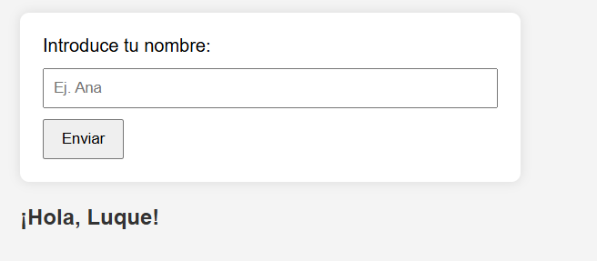
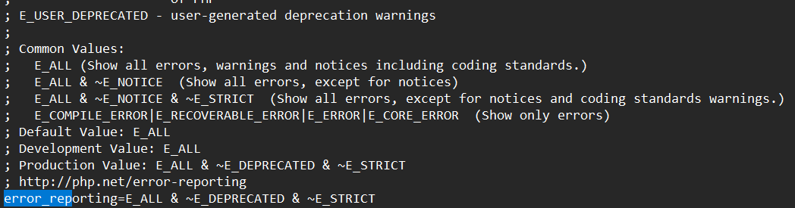
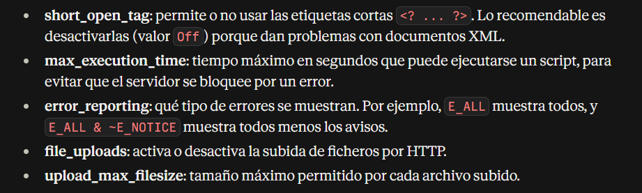

# UD1- ARQUITECTURA WEB

* [Enlace a Mi presentación](C:\xampp\htdocs\dwes\DWES_Cristina\README.md)

## Repositorio de :

* Antonio Jesus Luque Moreno

## PHP

* Iniciando PHP
* Hemos ejecutado los primeros scripts en php
* phpinfo da la información de php
* si se llama index.php se ejecuta primero

---

## PHP.INI

Muestra de errores por defecto en PHP.ini

