# Unidad 2 – Programación en PHP

## Saltos de línea

* El carácter especial "\n" introduce un salto de línea en el código fuente, pero el navegador no lo muestra como tal.

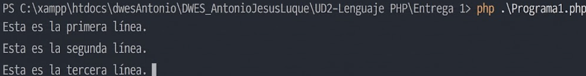

* Para que el salto se vea en pantalla hay que escribir la etiqueta HTML "br".

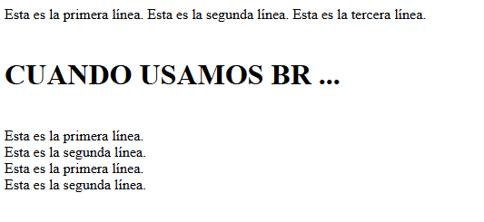

* La función "nl2br" transforma automáticamente cada "\n" de un texto en una etiqueta "br", de modo que el salto sí aparece en el navegador.

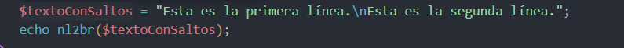

## Tipos de datos

* Declaración y uso de variables en PHP

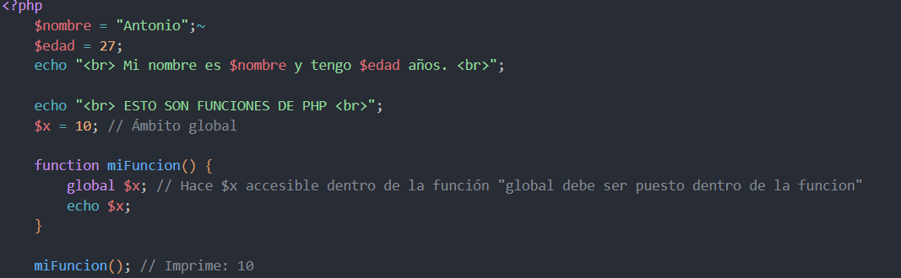

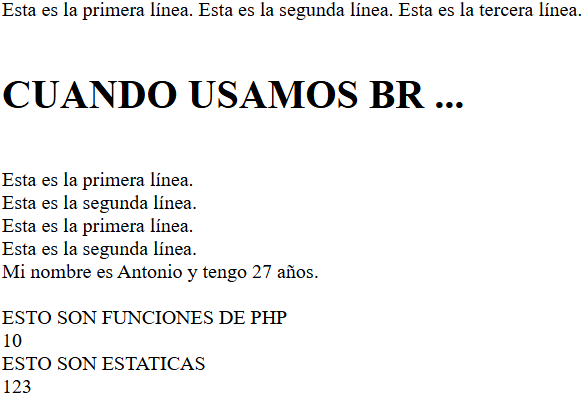

* Alcance (ámbito) de las variables

  * Globales: son las que se declaran fuera de cualquier función. Dentro de una función no se pueden usar directamente; para acceder a ellas hay que indicarlo con la palabra "global" en el interior de la función.

  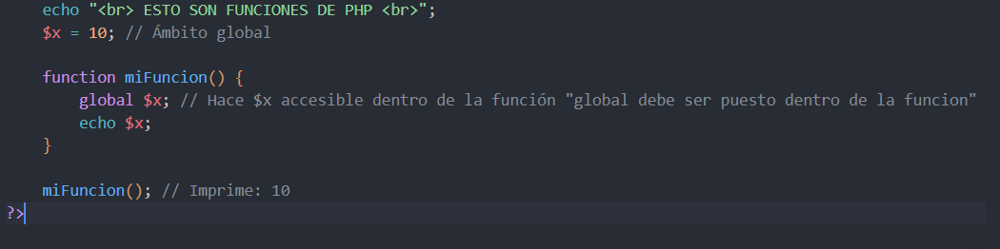

  * Locales: se crean dentro de una función y desaparecen cuando esta termina.
  * Estáticas: conservan su valor entre una llamada a la función y la siguiente.

  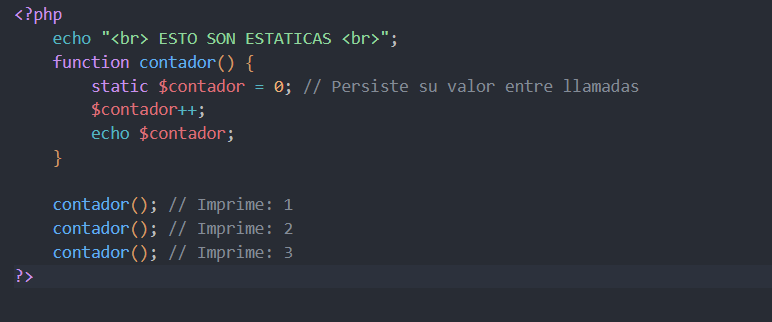

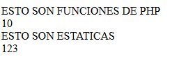

## Básico 2: el lenguaje PHP

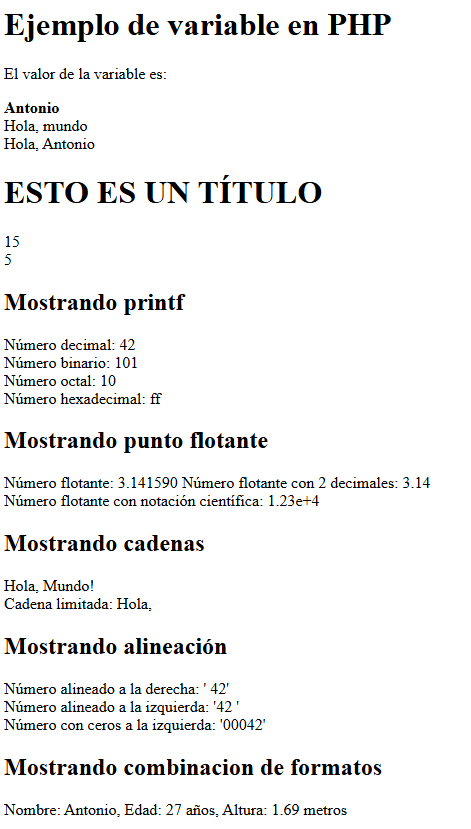

## Especificadores de formato

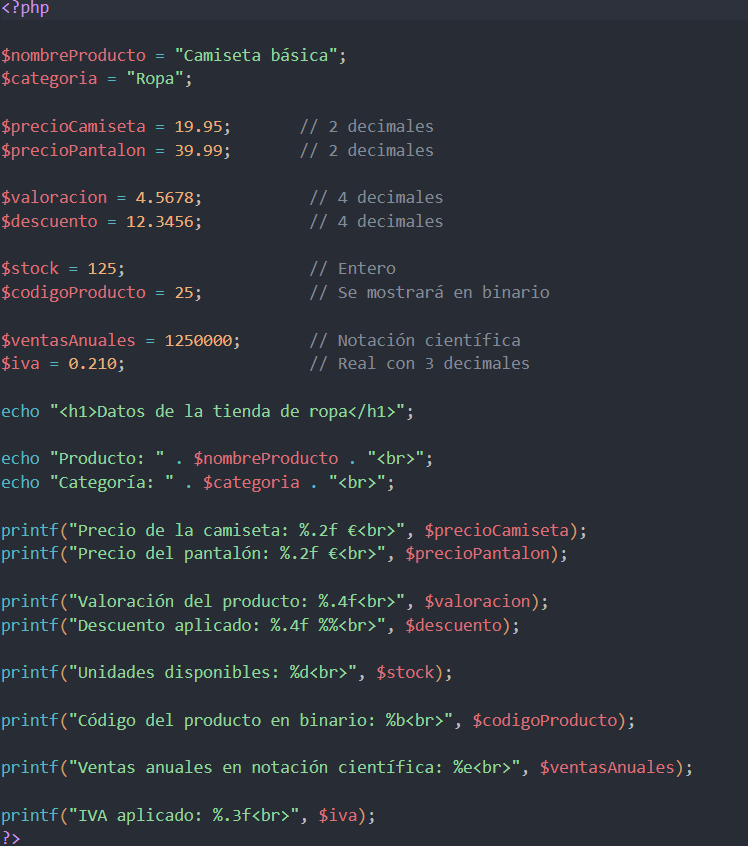

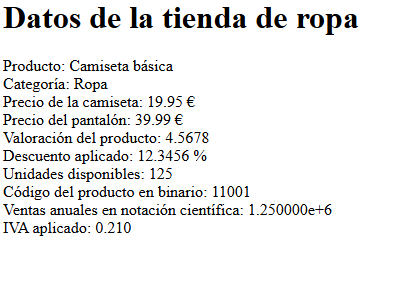

### Programa 4

* Uso de especificadores de formato junto con la función printf.

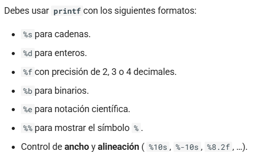

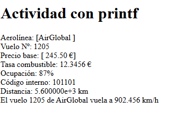

* Ejemplo con printf

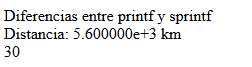

Ambas funciones aplican un formato al texto, pero se diferencian en el destino: printf() muestra el resultado directamente en la salida (navegador o pantalla), mientras que sprintf() lo devuelve como una cadena que se puede almacenar en una variable y reutilizar más adelante.

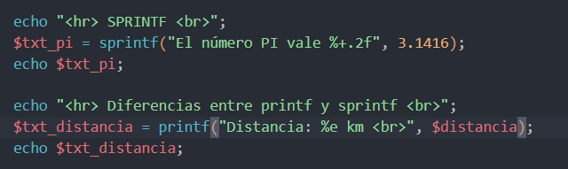

* Cadenas de caracteres

En PHP una cadena se puede escribir con comillas simples, comillas dobles, heredoc o nowdoc.

Si se usan comillas simples, PHP no interpreta las variables ni la mayoría de secuencias de escape que haya dentro:

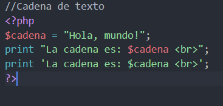

### Programa 5

* Caracteres Unicode

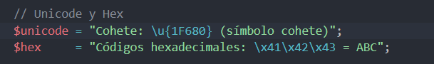

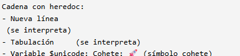

* Secuencias de escape más habituales

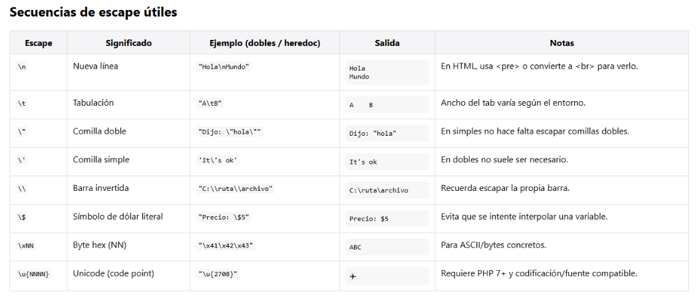

## Funciones para trabajar con datos

* gettype(): devuelve el tipo de una variable.
* settype(): convierte una variable a otro tipo.
* isset(): comprueba si una variable existe y no es null.
* unset(): elimina una variable.

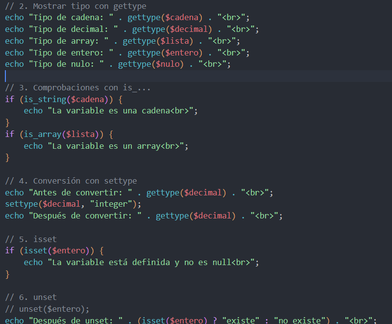

### Cómo evitar que se muestren errores

* Con **error_reporting**(**0**); se desactiva la notificación de errores.

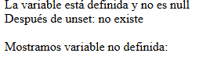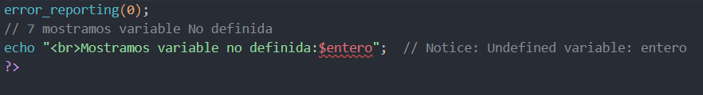

## Constantes y constantes predefinidas

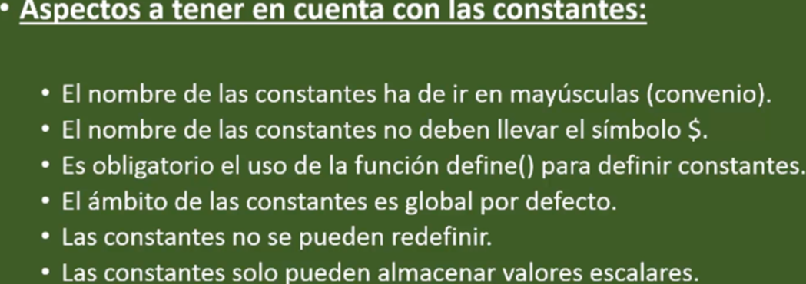

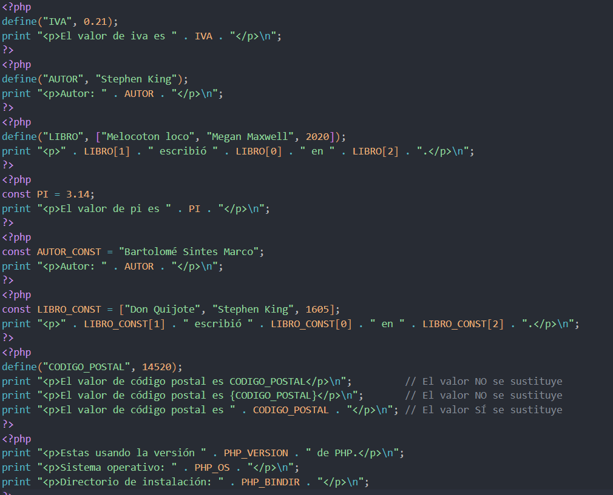

### Constantes predefinidas

Ejemplo de la salida obtenida al listar algunas constantes de error:

<pre>Array
(
    [E_ERROR] => 1
    [E_RECOVERABLE_ERROR] => 4096
    [E_WARNING] => 2
    [E_PARSE] => 4
    [E_NOTICE] => 8
    [E_STRICT] => 2048
    ...
)
</pre>

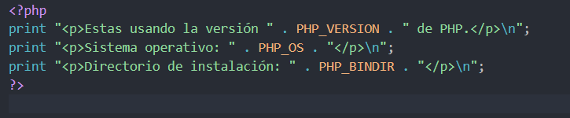

### Programa 8

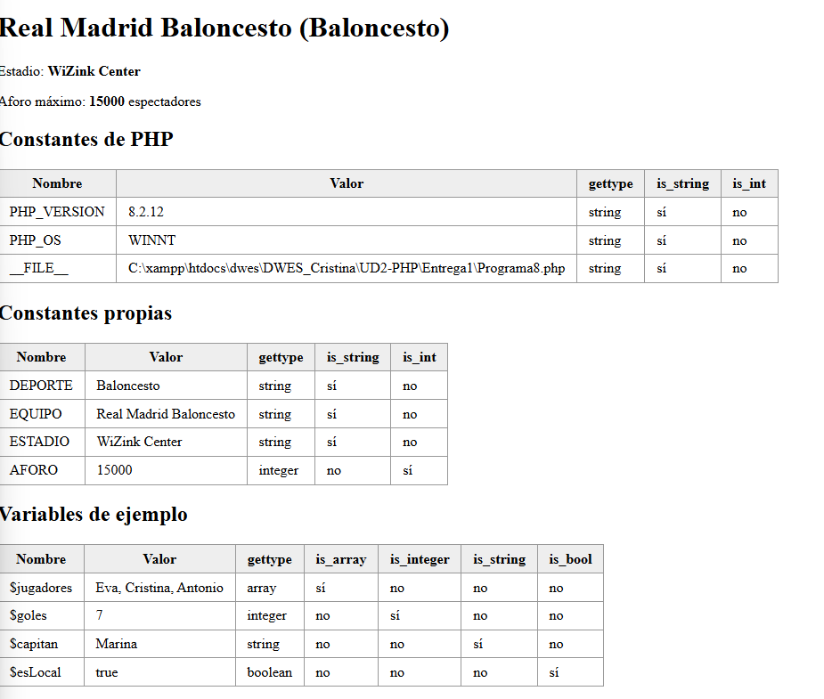

## Manejo de fechas y horas

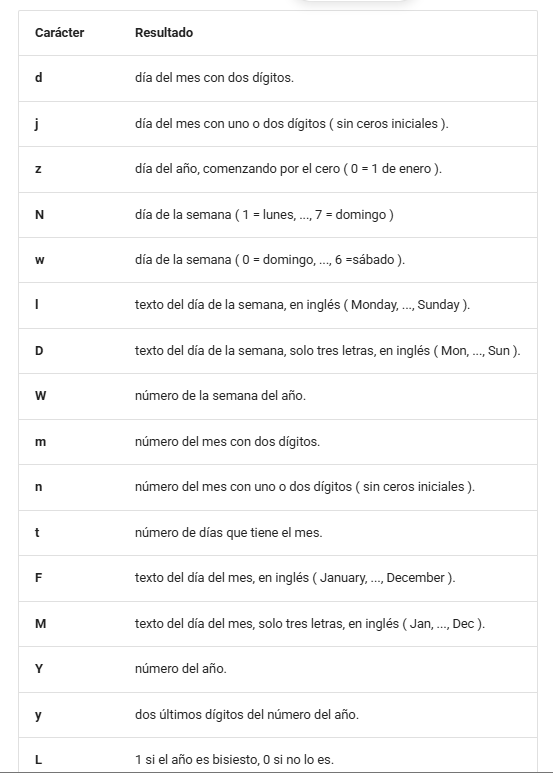

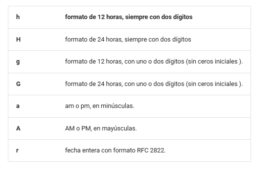

### Programa 9

## Variables superglobales de PHP

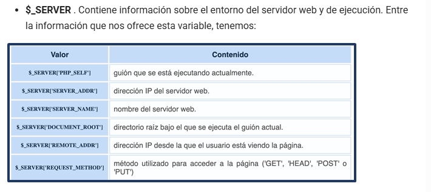

### Programa 10

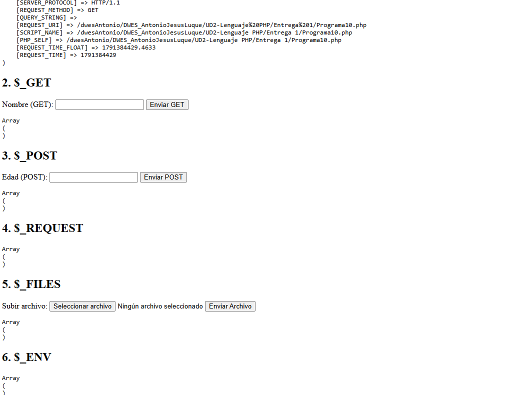
