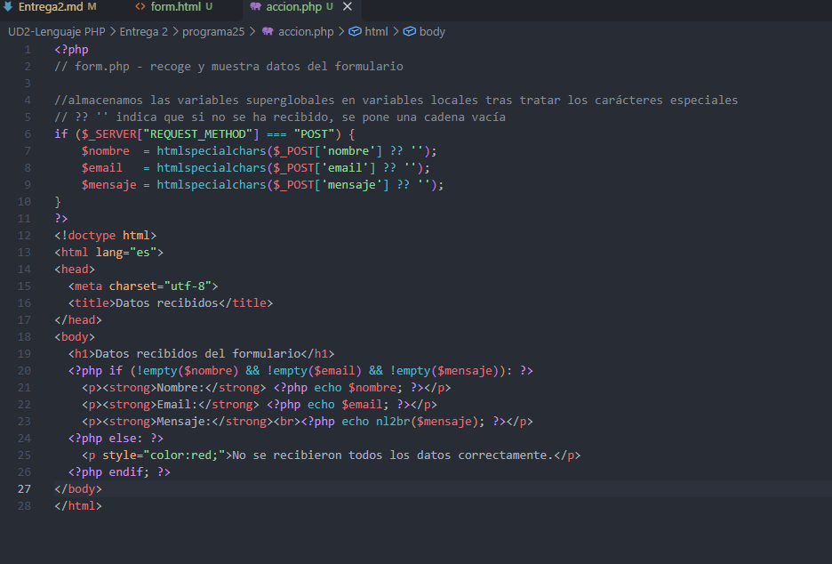
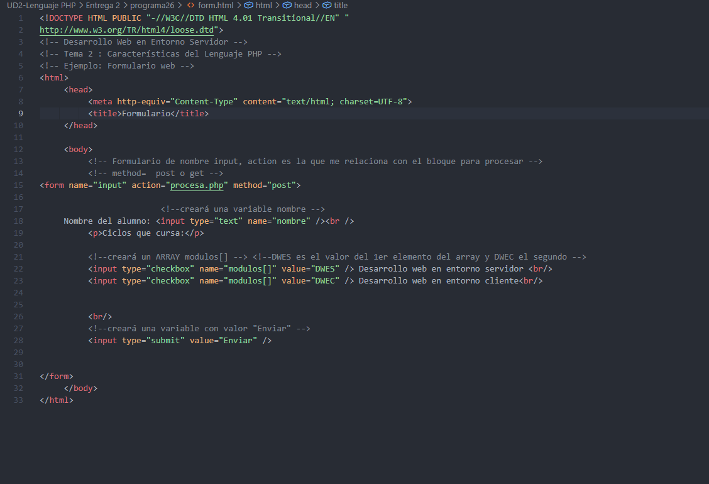

## array simple & asociativo

## array multidimensional

## array de punteros

## funciones de array

## formularios

al haber datos no hay problema y muestra los datos, pero si no se hubiesenintroducido, lo que apareceria sera el mensaje del else 

![Screen Recording 2026-10-06 135040.mp4 [video-to-gif output image]](https://s6.ezgif.com/tmp/ezgif-68eaa6cf48c51ca0.gif)

